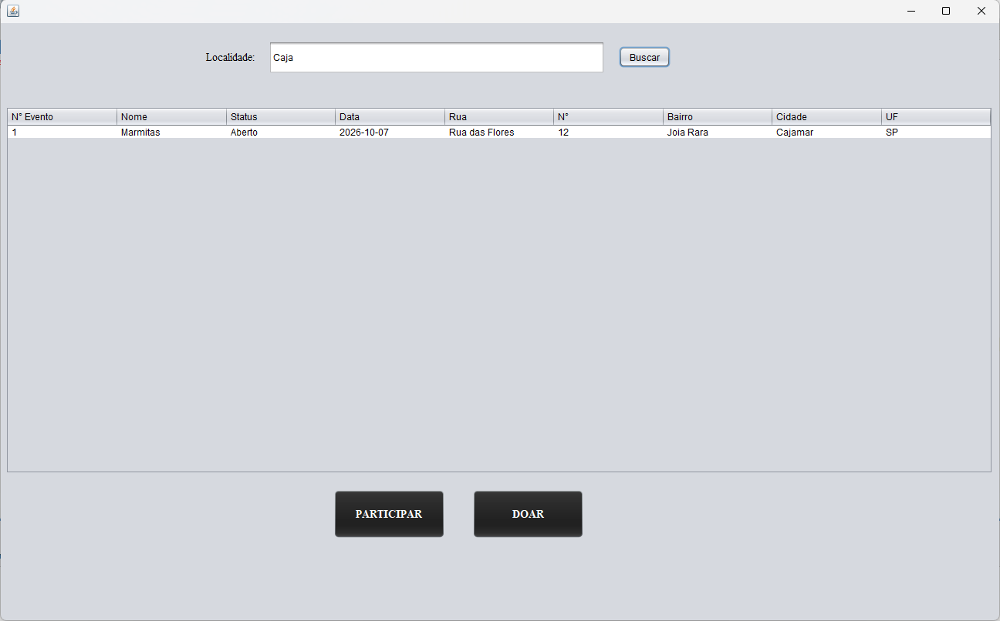
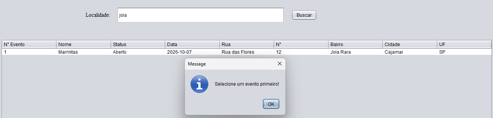
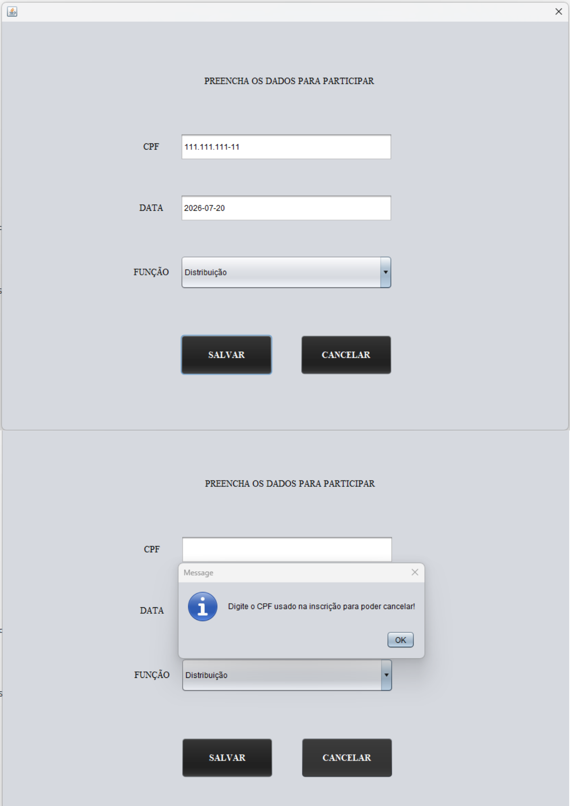
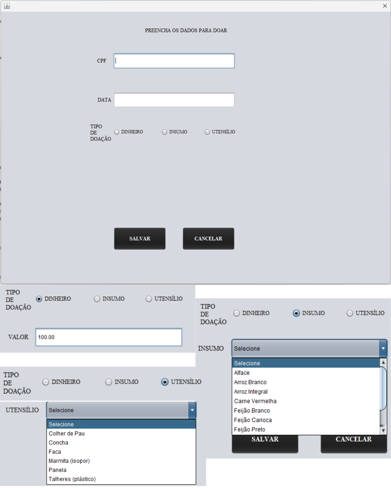

# Conecta Bem

## Sobre o projeto

O Conecta Bem é um projeto acadêmico desenvolvido com o objetivo de apoiar iniciativas de combate à insegurança alimentar. A proposta da plataforma é conectar organizadores, voluntários e doadores por meio de eventos solidários. Neste repositório estão implementadas as funcionalidades desenvolvidas em equipe durante a disciplina de Laboratório de Banco de Dados, contemplando o gerenciamento de eventos, participação de voluntários e registro de doações, integradas a um banco de dados MySQL. A visão completa do projeto inclui outras funcionalidades que poderão ser desenvolvidas futuramente, mas que não fazem parte do escopo desta implementação.

## ✨ Funcionalidades

### Eventos
- Cadastro, Edição, Consulta e Exclusão
- Busca por cidade ou bairro

### Participação
- Cadastro de voluntários
- Escolha da função desempenhada

### Doação
- Doação em dinheiro
- Doação de insumos (ex: arroz)
- Doação de utensílios (ex: panela)
- Registro das contribuições 

### Gerenciamento
- Consulta de participantes
- Consulta de doações
- Integração com banco de dados

## 🛠️ Tecnologias

- Java
- Python
- MySQL
- JDBC
- Java Swing

## 🖥️ Interface do Sistema

### Cadastro, Edição e Exclusão de Eventos

  

### Tela Inicial e busca

  

  

### Participação e Doações

    
    

## 🎯 Aprendizados
Durante o desenvolvimento deste projeto foram aplicados conhecimentos como:

- Integração entre Java, Python e MySQL
- Persistência de dados utilizando JDBC
- Operações CRUD completas
- Desenvolvimento de interfaces gráficas com Java Swing
- Modelagem de banco de dados relacional
- Levantamento de requisitos
- Prototipação das telas no Figma
- Diagramas de Casos de Uso
- Trabalho em equipe
- Planejamento e organização de projeto acadêmico

## 🎥 Demonstração

Assista ao vídeo completo do projeto:

▶️ https://www.youtube.com/watch?v=XC3ZgDKprqg&list=PLNmfZL7dZh_0&index=1&t=124s
