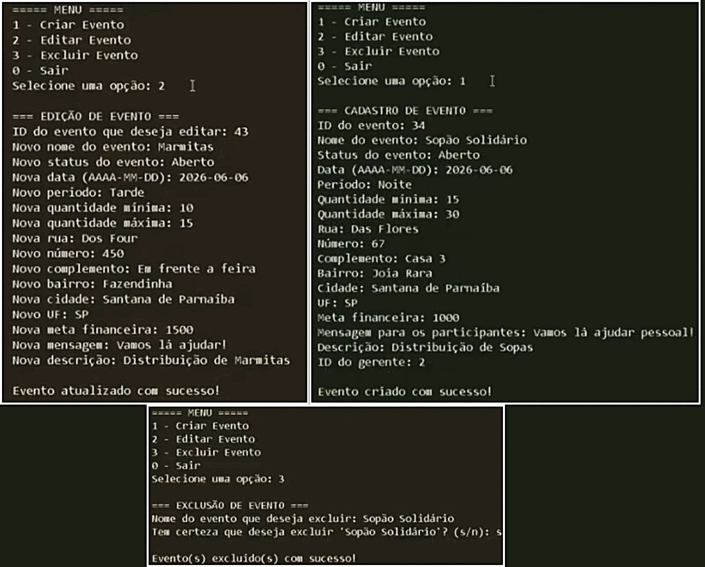
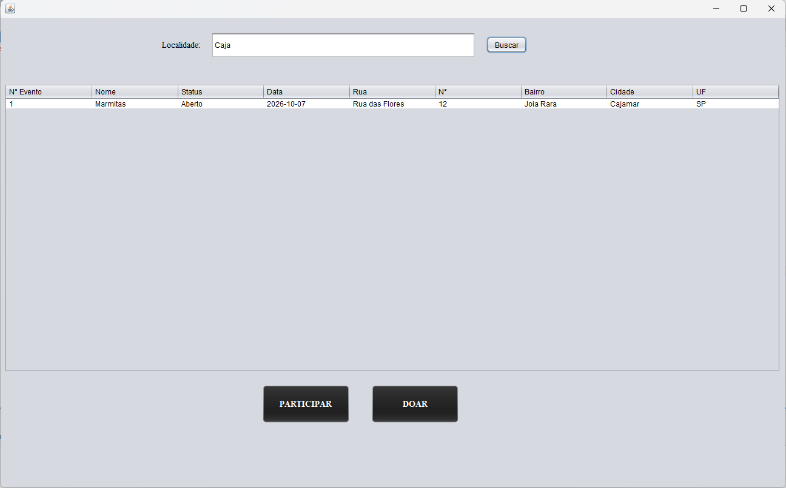
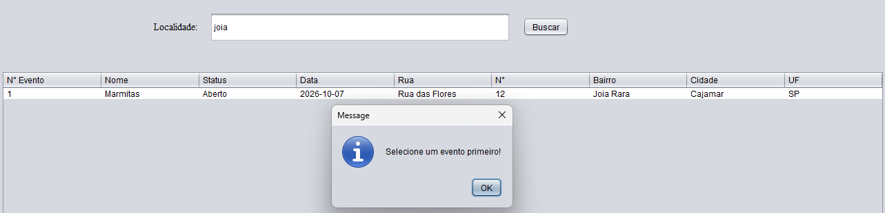
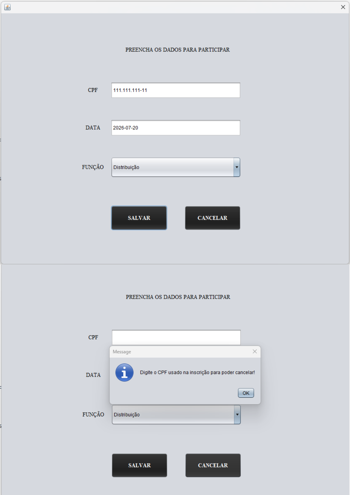
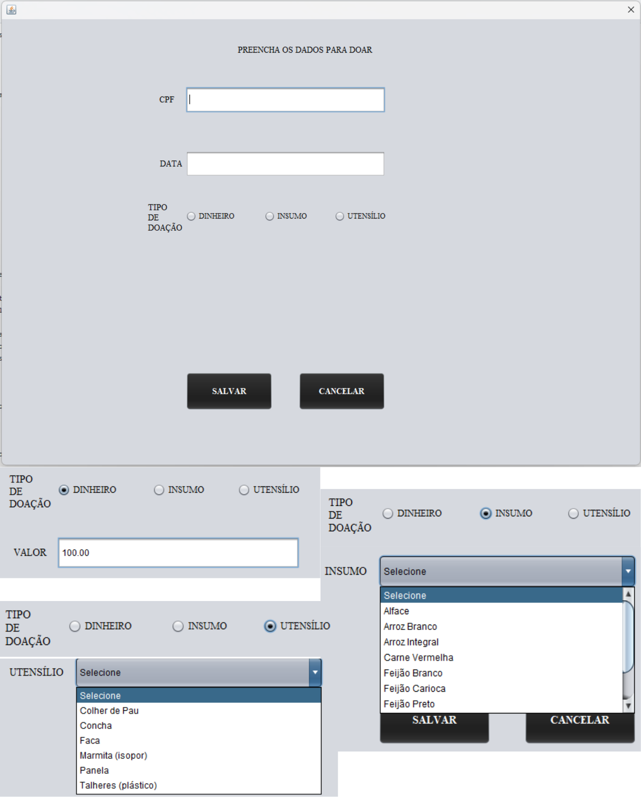

# Conecta Bem

## Sobre o projeto

> ⚠️ Este repositório reflete as funcionalidades que desenvolvi individualmente e em equipe durante a disciplina de **Laboratório de Banco de Dados**.

O **Conecta Bem** é um projeto acadêmico desenvolvido com o objetivo de apoiar iniciativas de combate à insegurança alimentar. A proposta da plataforma é conectar organizadores, voluntários e doadores por meio de eventos solidários. 
Nesta implementação, desenvolvemos um programa em **Python** e uma interface em **Java Swing** que foram integrados a um banco de dados **MySQL** para:
- Cadastro e gerenciamento de eventos
- Participação de voluntários 
- Registro de doações

A visão completa do projeto inclui outras funcionalidades que poderão ser desenvolvidas futuramente, mas que não fazem parte do escopo desta implementação.

## ✨ Funcionalidades

### Eventos
- Cadastro, Edição, Consulta e Exclusão
- Busca por cidade ou bairro

### Participação
- Cadastro de voluntários
- Escolha da função desempenhada

### Doação
- Doação em dinheiro
- Doação de insumos (ex: arroz)
- Doação de utensílios (ex: panela)
- Registro das contribuições 

### Gerenciamento
- Consulta de participantes
- Consulta de doações
- Integração com banco de dados

## 🛠️ Tecnologias

- Java
- Python
- MySQL
- JDBC
- Java Swing

## 🖥️ Interface do Sistema

### Cadastro, Edição e Exclusão de Eventos

<p align="center">
  
</p>

### Tela Inicial e busca

<p align="center">
  
</p>
<p align="center">
  
</p>

### Participação

<p align="center">
    
</p>

### Doações

<p align="center">
    
</p>

## 🎯 Aprendizados
Durante o desenvolvimento deste projeto foram aplicados conhecimentos como:

- Integração entre Java, Python e MySQL
- Persistência de dados utilizando JDBC
- Operações CRUD completas
- Desenvolvimento de interfaces gráficas com Java Swing
- Modelagem de banco de dados relacional
- Levantamento de requisitos
- Prototipação das telas no Figma
- Diagramas de Casos de Uso
- Trabalho em equipe
- Planejamento e organização de projeto acadêmico

## 🎥 Demonstração

Assista ao vídeo completo do projeto clicando na imagem abaixo (será redirecionado para o YouTube):

<a href="https://www.youtube.com/watch?v=XC3ZgDKprqg&list=PLNmfZL7dZh_0&index=1&t=124s">
  
</a>

## 🚀 Como Executar

### 1. Clonar o Repositório
```bash
git clone https://github.com/Ingryd-Salinas/conecta-bem.git
cd conecta-bem
```
### 2. Configurar o Banco de Dados
1. Abra o **MySQL Workbench**.
2. Execute o arquivo `BancoDeDados.sql` (localizado na pasta `src/`) para criar a estrutura do banco.
3. Certifique-se de que o banco `conectabem` foi criado com sucesso.

⚠️ **Atenção:** Lembre-se de ajustar as credenciais de acesso ao banco (`user` e `password`) nos arquivos de código Python e Java para que correspondam à sua configuração local do MySQL.

### 3. Executar a aplicação

Escolha uma das tecnologias abaixo para rodar:

#### 🐍 Python
1. Abra o terminal na pasta do projeto Python.
2. Instale o driver do MySQL:
   ```bash
   pip install mysql-connector-python
   ```
3. Execute o script principal:
   ```bash
   python CadastroEvento.py
   ```

#### ☕ Java (NetBeans)
1. Abra a IDE **NetBeans**.
2. Vá em `File > Open Project` e selecione a pasta `ConectaBem`.
3. Se a IDE solicitar o driver do MySQL (`mysql-connector-java`), aponte para o arquivo `.jar` que está localizado dentro da pasta do projeto.
4. Clique no botão **Run** (Executar).
